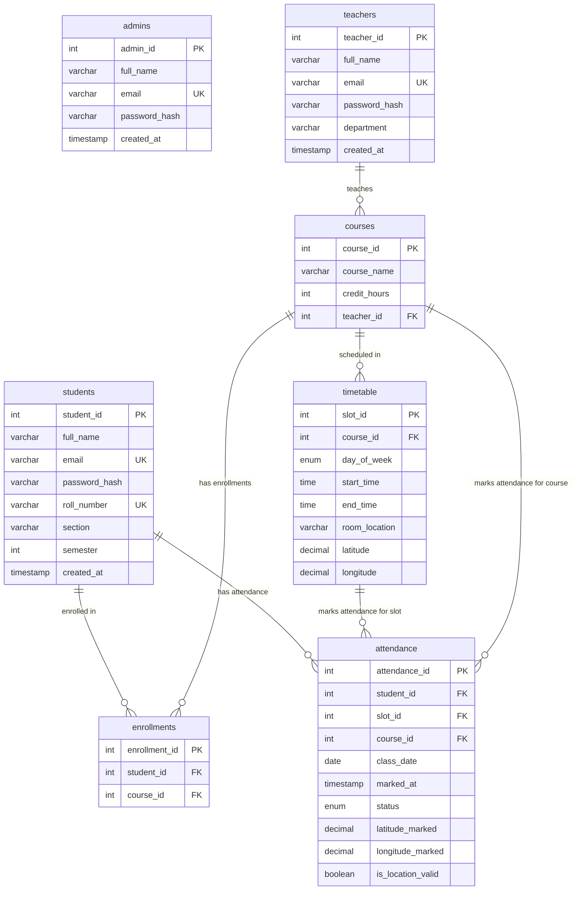

# Database Schema Reference

This reference document synthesizes the database structure, tables, constraints, relationships, and mock datasets for the **Smart Attendance Management System**.

---

## 📊 Entity Relationship Diagram (ERD)

The following Mermaid diagram visualizes the tables, fields, and relationships defined in `schema.sql`.



---

## ⚠️ Critical DDL Schema Anomalies

> [!WARNING]
> In `schema.sql` (lines 2-3), there is a database naming typo:
> ```sql
> CREATE DATABASE atendance; -- Spelled with one 't'
> USE attendance;            -- Spelled with two 't's
> ```
> Running this script sequentially will result in an `Unknown database 'attendance'` error during execution. It is highly recommended to standardize on **`attendance`** (with two 't's).

---

## 🗂️ Detailed Table Specifications

### 1. `admins`
Stores administration accounts responsible for overall system configuration.

| Column | Data Type | Constraints | Description |
| :--- | :--- | :--- | :--- |
| `admin_id` | `INT` | `AUTO_INCREMENT`, `PRIMARY KEY` | Unique identifier for each administrator. |
| `full_name` | `VARCHAR(100)` | `NOT NULL` | The admin's full name. |
| `email` | `VARCHAR(100)` | `NOT NULL`, `UNIQUE` | Email used for logging in. |
| `password_hash` | `VARCHAR(255)` | `NOT NULL` | Blowfish/bcrypt hashed password. |
| `created_at` | `TIMESTAMP` | `DEFAULT CURRENT_TIMESTAMP` | Account creation timestamp. |

---

### 2. `teachers`
Stores details of the teaching staff.

| Column | Data Type | Constraints | Description |
| :--- | :--- | :--- | :--- |
| `teacher_id` | `INT` | `AUTO_INCREMENT`, `PRIMARY KEY` | Unique identifier for each teacher. |
| `full_name` | `VARCHAR(100)` | `NOT NULL` | Teacher's full name. |
| `email` | `VARCHAR(100)` | `NOT NULL`, `UNIQUE` | Contact & login email address. |
| `password_hash` | `VARCHAR(255)` | `NOT NULL` | Hashed password. |
| `department` | `VARCHAR(100)` | `NOT NULL` | Associated academic department (e.g., CS). |
| `created_at` | `TIMESTAMP` | `DEFAULT CURRENT_TIMESTAMP` | Profile creation timestamp. |

---

### 3. `students`
Stores details of academic students.

| Column | Data Type | Constraints | Description |
| :--- | :--- | :--- | :--- |
| `student_id` | `INT` | `AUTO_INCREMENT`, `PRIMARY KEY` | Unique identifier for each student. |
| `full_name` | `VARCHAR(100)` | `NOT NULL` | Student's full name. |
| `email` | `VARCHAR(100)` | `NOT NULL`, `UNIQUE` | Student's university email address. |
| `password_hash` | `VARCHAR(255)` | `NOT NULL` | Hashed password. |
| `roll_number` | `VARCHAR(20)` | `NOT NULL`, `UNIQUE` | Official enrollment register number. |
| `section` | `VARCHAR(10)` | `NOT NULL` | Class section name (e.g., 'A', 'B'). |
| `semester` | `INT` | `NOT NULL` | Current semester number. |
| `created_at` | `TIMESTAMP` | `DEFAULT CURRENT_TIMESTAMP` | Student record creation timestamp. |

---

### 4. `courses`
Academic courses assigned to teachers.

| Column | Data Type | Constraints | Description |
| :--- | :--- | :--- | :--- |
| `course_id` | `INT` | `AUTO_INCREMENT`, `PRIMARY KEY` | Unique identifier for each course. |
| `course_name` | `VARCHAR(100)` | `NOT NULL` | Official name of the course. |
| `credit_hours` | `INT` | `NOT NULL` | Number of course credit hours. |
| `teacher_id` | `INT` | `NOT NULL`, `FOREIGN KEY` | Refers to `teachers(teacher_id)`. |

*   **Foreign Key Constraint**:
    *   `fk_course_teacher`: `FOREIGN KEY (teacher_id) REFERENCES teachers(teacher_id) ON DELETE RESTRICT ON UPDATE CASCADE`
    *   *Behavior*: Prevents deletion of a teacher profile if they have active courses assigned (`ON DELETE RESTRICT`).

---

### 5. `enrollments`
A mapping table that establishes the many-to-many relationship between `students` and `courses`.

| Column | Data Type | Constraints | Description |
| :--- | :--- | :--- | :--- |
| `enrollment_id` | `INT` | `AUTO_INCREMENT`, `PRIMARY KEY` | Unique registration index. |
| `student_id` | `INT` | `NOT NULL`, `FOREIGN KEY` | Refers to `students(student_id)`. |
| `course_id` | `INT` | `NOT NULL`, `FOREIGN KEY` | Refers to `courses(course_id)`. |

*   **Unique Constraint**:
    *   `uq_enrollment`: `UNIQUE (student_id, course_id)` ensures a student cannot enroll in the same course multiple times.
*   **Foreign Key Constraints**:
    *   `fk_enroll_student`: `FOREIGN KEY (student_id) REFERENCES students(student_id) ON DELETE CASCADE ON UPDATE CASCADE`
    *   `fk_enroll_course`: `FOREIGN KEY (course_id) REFERENCES courses(course_id) ON DELETE CASCADE ON UPDATE CASCADE`
    *   *Behavior*: If a student or course is deleted, the enrollment mapping is automatically deleted (`ON DELETE CASCADE`).

---

### 6. `timetable`
Defines recurring scheduled slots, rooms, and geolocations for each course.

| Column | Data Type | Constraints | Description |
| :--- | :--- | :--- | :--- |
| `slot_id` | `INT` | `AUTO_INCREMENT`, `PRIMARY KEY` | Unique schedule slot identifier. |
| `course_id` | `INT` | `NOT NULL`, `FOREIGN KEY` | Refers to `courses(course_id)`. |
| `day_of_week` | `ENUM('Mon','Tue','Wed','Thu','Fri')` | `NOT NULL` | Class day. |
| `start_time` | `TIME` | `NOT NULL` | Class start time. |
| `end_time` | `TIME` | `NOT NULL` | Class end time. |
| `room_location` | `VARCHAR(100)` | `NOT NULL` | Classroom room string (e.g. CS Lab 2). |
| `latitude` | `DECIMAL(9,6)` | `NOT NULL` | Target latitude for class attendance. |
| `longitude` | `DECIMAL(9,6)` | `NOT NULL` | Target longitude for class attendance. |

*   **Foreign Key Constraint**:
    *   `fk_timetable_course`: `FOREIGN KEY (course_id) REFERENCES courses(course_id) ON DELETE CASCADE ON UPDATE CASCADE`

---

### 7. `attendance`
Stores log entries for marked student attendance, verified against time and geolocation parameters.

| Column | Data Type | Constraints | Description |
| :--- | :--- | :--- | :--- |
| `attendance_id` | `INT` | `AUTO_INCREMENT`, `PRIMARY KEY` | Unique attendance record log index. |
| `student_id` | `INT` | `NOT NULL`, `FOREIGN KEY` | Refers to `students(student_id)`. |
| `slot_id` | `INT` | `NOT NULL`, `FOREIGN KEY` | Refers to `timetable(slot_id)`. |
| `course_id` | `INT` | `NOT NULL`, `FOREIGN KEY` | Refers to `courses(course_id)`. |
| `class_date` | `DATE` | `NOT NULL` | Date of the lecture. |
| `marked_at` | `TIMESTAMP` | `DEFAULT CURRENT_TIMESTAMP` | Verification timestamp. |
| `status` | `ENUM('Present','Absent')` | `NOT NULL` | Final attendance status. |
| `latitude_marked` | `DECIMAL(9,6)` | `NOT NULL` | Geolocation latitude reported by student. |
| `longitude_marked` | `DECIMAL(9,6)` | `NOT NULL` | Geolocation longitude reported by student. |
| `is_location_valid` | `BOOLEAN` | `NOT NULL DEFAULT FALSE` | Flag showing if the student was at the venue. |

*   **Unique Constraint**:
    *   `uq_attendance`: `UNIQUE (student_id, slot_id, class_date)` prevents duplicate logs for the same student, schedule slot, and date.
*   **Foreign Key Constraints**:
    *   `fk_att_student`: `FOREIGN KEY (student_id) REFERENCES students(student_id) ON DELETE CASCADE ON UPDATE CASCADE`
    *   `fk_att_slot`: `FOREIGN KEY (slot_id) REFERENCES timetable(slot_id) ON DELETE CASCADE ON UPDATE CASCADE`
    *   `fk_att_course`: `FOREIGN KEY (course_id) REFERENCES courses(course_id) ON DELETE CASCADE ON UPDATE CASCADE`

---

## 📁 Dataset Reference (Mock Files)

The `Dataset/` folder contains CSV text files populated with pre-configured mock data. These can be imported directly into MySQL as outlined in `schema.sql`:

1.  **`admins.csv`**
    *   Populates: `admins` table.
    *   *Fields*: Admin ID, name, email, password_hash, created_at.
2.  **`teachers.csv`**
    *   Populates: `teachers` table.
    *   *Fields*: Teacher ID, full_name, email, password_hash, department, created_at.
3.  **`students.csv`**
    *   Populates: `students` table.
    *   *Fields*: Student ID, full_name, email, password_hash, roll_number, section, semester, created_at.
4.  **`courses.csv`**
    *   Populates: `courses` table.
    *   *Fields*: Course ID, course_name, credit_hours, teacher_id.
5.  **`enrollments.csv`**
    *   Populates: `enrollments` table.
    *   *Fields*: Enrollment ID, student_id, course_id.
6.  **`timetable.csv`**
    *   Populates: `timetable` table.
    *   *Fields*: Slot ID, course_id, day_of_week, start_time, end_time, room_location, latitude, longitude.
7.  **`attendance.csv`**
    *   Populates: `attendance` table.
    *   *Fields*: Attendance ID, student_id, slot_id, course_id, class_date, marked_at, status, latitude_marked, longitude_marked, is_location_valid.
8.  **`dataset.py`**
    *   A helper Python script used for programmatically generating or validating the CSV datasets listed above.
