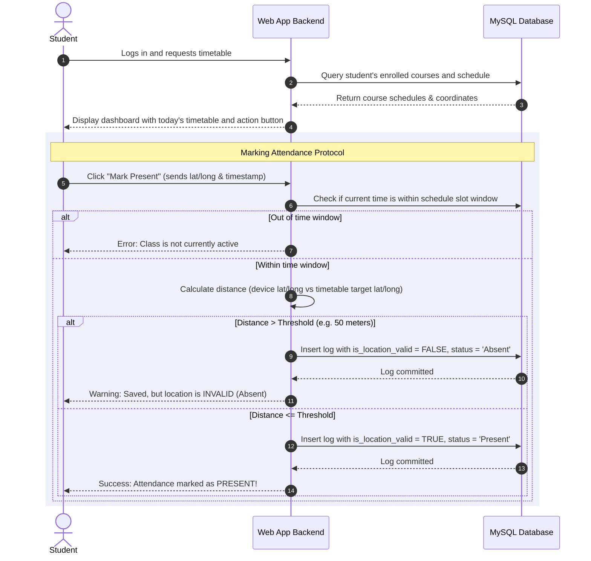

# Project Requirements & System Flow

This document details the functional specifications, target objectives, technology stack, and step-by-step logic workflows for the **Smart Attendance Management System**, extracted directly from the system proposal documents.

---

## 📌 Project Overview & Objectives

Traditional paper-based attendance or basic spreadsheets suffer from structural inconsistencies, proxy submissions, and high manual administration overhead. This system introduces a **database-driven, location-aware, and time-restricted** attendance marking portal to bring speed, accuracy, and robust historical auditing to academic institutions.

### Core Goals:
1.  **Eliminate Proxy Attendance**: Enforce verification using device timestamp matching and browser-based GPS geofencing.
2.  **Ensure Data Integrity**: Utilize relational constraints to guarantee students cannot log double entries or register attendance for courses they are not enrolled in.
3.  **Provide Real-Time Monitoring**: Empower instructors with an interactive calendar-based control center to audit logs instantly.
4.  **Automated Calculations**: Compile automated attendance percentages, trends, and warning flags for students falling below criteria.

---

## 🔄 System Flow: Attendance Marking Sequence

The flow diagram below represents the verification sequence executed when a student attempts to mark their attendance.

---

## ⚙️ Functional Requirements

The system's features are categorized into six functional modules:

### A. User Management
*   **Authentication & Access Control**: Separate secure portals for Students, Teachers, and Admins.
*   **Role-Based Dashboards**:
    *   *Admins*: Overall configuration and script controls.
    *   *Teachers*: Class logs, calendar rosters, and exports.
    *   *Students*: Customized timetables and historical tracking.

### B. Timetable & Course Management
*   **Student Timetable View**: Students see a dynamic timetable mapping only the courses they are officially registered for.
*   **Teacher Allocation View**: Teachers see a list of their assigned courses, schedule slots, and designated classroom locations.
*   **Location Coordinates mapping**: Association of geographical coordinates (latitude and longitude) with physical classrooms inside the database.

### C. Geofenced Attendance Verification
*   **Window Checking**: Enforce that attendance can only be logged during active class windows defined in the `timetable` table (checking `day_of_week`, `start_time`, and `end_time`).
*   **Geofence Validation**: Compute the distance between the student's browser-reported coordinate and the preset room coordinate.
*   **Log Preservation**: Automatically commit the verification flags, coordinates, and exact submission timestamps to the database audit record.
*   **Duplication Prevention**: Database-level constraints ensure no student can submit multiple logs for the same course on the same day.

### D. Teacher Dashboard & Monitoring
*   **Query Filtering**: Load lists filtered dynamically by Course, specific Dates, or individual Students.
*   **Calendar Matrix**: A visual calendar displaying attendance history, color-coded by class status.
*   **Correction Mechanism**: Override capabilities to manually correct false logs or excuse absences (with audit notes).

### E. Reporting & Analytics
*   **Ratios & Summaries**: Live percentage calculations indicating aggregate attendance.
*   **Alert Generation**: Visual warnings triggered for students whose aggregate attendance drops below target thresholds (e.g. 75%).
*   **Report Exporting**: Options to export lists or automatically trigger email alerts containing class summaries.

### F. Security & Input Verification
*   **Credentials Security**: Secure hashing of passwords (using strong bcrypt schemes).
*   **Boundary Checking**: Strict validation of coordinates, dates, and email strings.
*   **Database Constraints**: Use of `ON DELETE CASCADE` and `UNIQUE` indexes to protect references.

---

## 🛠️ Proposed Tech Stack

*   **Frontend**: HTML, CSS, JavaScript (Vanilla implementation for clean, fast layouts).
*   **Backend**: Node.js + Express.js for scalable asynchronous logic and request handling.
*   **Database**: MySQL Relational Database (central focus for structured data storage, relationships, and queries).
*   **Libraries/Integrations**:
    *   *ORM (Sequelize)*: Optional, for query handling and abstracting database schema definitions.
    *   *Email Notification Engine (Nodemailer)*: For automated status reports.
    *   *Browser Geolocation API*: To retrieve high-precision user latitude and longitude values securely.
